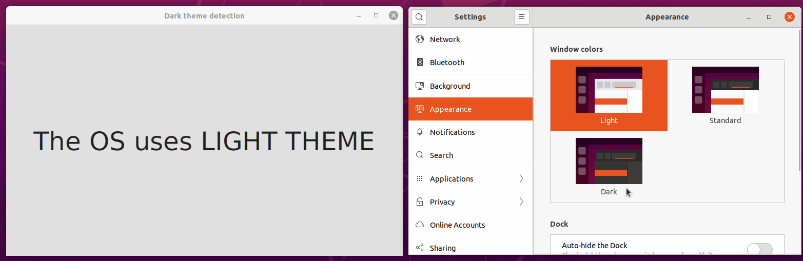
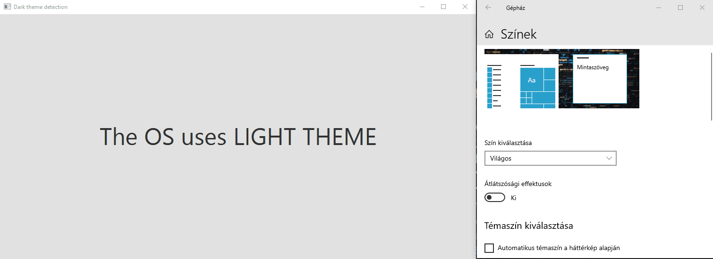

# jSystemThemeDetector

[](https://jitpack.io/#Dansoftowner/jSystemThemeDetector)
[](https://github.com/Dansoftowner/jSystemThemeDetector/commits/master)
[](https://github.com/Dansoftowner/jSystemThemeDetector/issues)
[](LICENSE)

In most modern operating systems there is a dark mode option. This library is created for detecting 
this using java.

It can be useful for example if you want to synchronize your GUI App's look and feel with the operating system.

> This library is inspired by the dark-theme detection in [Intellij Idea](https://github.com/JetBrains/intellij-community).

# Compatibility
It works on **Windows 10**, **MacOS Mojave** (or later) and even on **some Linux distributions**.

# Requirements
**Java 11 or higher**

# Basic examples

#### Simple detection
```java
final OsThemeDetector detector = OsThemeDetector.getDetector();
final boolean isDarkThemeUsed = detector.isDark();
if (isDarkThemeUsed) {
    //The OS uses a dark theme
} else {
    //The OS uses a light theme
}
```

#### Listening to changes

```java
final OsThemeDetector detector = OsThemeDetector.getDetector();
detector.registerListener(isDark -> {
    if (isDark) {
        //The OS switched to a dark theme
    } else {
        //The OS switched to a light theme
    }
});
```

#### Using it with JavaFX/Swing
If you use the listener for changing the UI in a **JavaFX** application, make sure you use `Platform.runLater` in it:
```java
final OsThemeDetector detector = OsThemeDetector.getDetector();
detector.registerListener(isDark -> {
    Platform.runLater(() -> {
        if (isDark) {
            // The OS switched to a dark theme
        } else {
            // The OS switched to a light theme
        }
    });
});
```
It's important because if you are doing JavaFX specific stuff in the listener, you should execute it on the UI thread (`JavaFX Application Thread`).
Otherwise, you might face some serious issues.

In case of **AWT/Swing**, use `SwingUtilities.invokeLater` for the same reason:
```java
final OsThemeDetector detector = OsThemeDetector.getDetector();
detector.registerListener(isDark -> {
    SwingUtilities.invokeLater(() -> {
        if (isDark) {
            // The OS switched to a dark theme
        } else {
            // The OS switched to a light theme
        }
    });
});
```

# Using it with Gradle, Maven... etc
It's available on [JitPack](https://jitpack.io/#Dansoftowner/jSystemThemeDetector)!

Gradle example:
```groovy
repositories {
	...
	maven { url 'https://jitpack.io' }
}

dependencies {
    implementation 'com.github.Dansoftowner:jSystemThemeDetector:3.6'
}
```

# GUI Demo application

There is a Demo application available [here](src/test/java/GuiDemo.java). It's 
a basic JavaFX application that changes the UI when the OS switched to a dark/light theme.

### Linux/Ubuntu example


### Windows 10 example


# Projects using `jSystemThemeDetector`
If this library is used by your project, let me know in the `Discussions` and I will mention that in this section. 

* [Boomega](https://github.com/Dansoftowner/Boomega) - A modern book explorer & catalog application
* [Document Archiver](https://github.com/Document-Archiver/com.sophisticatedapps.archiving.document-archiver) - Archive all your documents in a consistent way, which enables you to retrieve them later fast and easy.

# Used libraries

 - [SLF4J](http://www.slf4j.org/) - Simple Logging Facade for Java
 - [Jetbrains Annotations](https://github.com/JetBrains/java-annotations) - Annotations for JVM-based languages
 - [JNA](https://github.com/java-native-access/jna) - Java Native Access
 - [JFA](https://github.com/0x4a616e/jfa) - Java Foundation Access
 - [OSHI](https://github.com/oshi/oshi) - Operating system & hardware information
 - [Version Compare](https://github.com/G00fY2/version-compare) - Lightweight Android & Java library to compare version strings.
